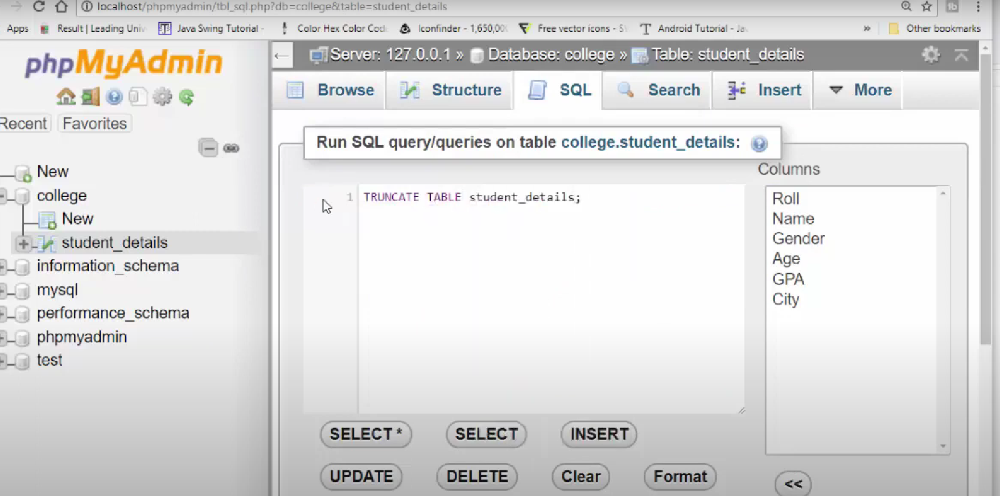
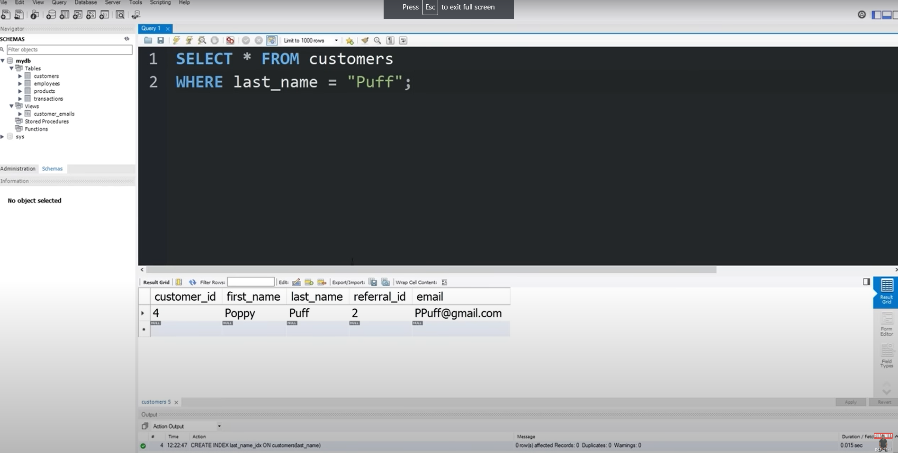
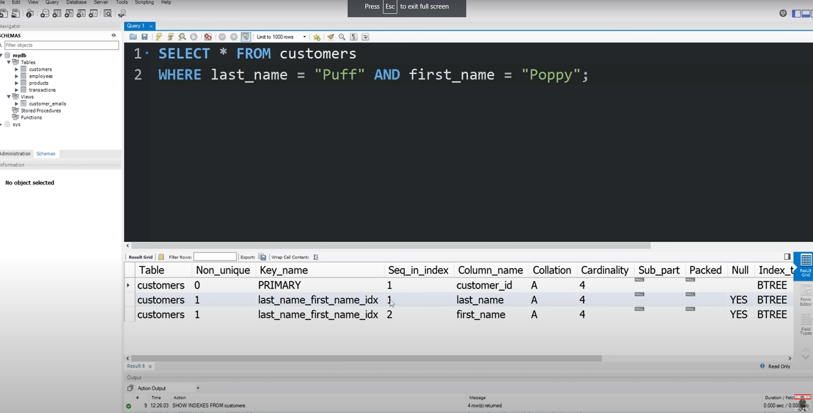

# training
training from slack training channel LEAD BY JULIUS BROTHER.

1. Git & GitHub Crash Course For Beginners (All GIven By Julius Bhai)
- [youtube link given by julius bhai](https://youtu.be/SWYqp7iY_Tc?si=-s81qpIXyQhFke-c)
- [Git Tutorial for Beginners: Learn Git in 1 Hour](https://youtu.be/8JJ101D3knE?si=qCz8YU4h3UtnLLNM)
- [Git tutorial from julius bhai](https://drive.google.com/file/d/1FLdUJmQlQ9RYbZKzb6fEpDXBhRN6dz_W/view)
- [Julius Bhai Reppo Git example](https://github.com/juliusiqbal/php.git)

2. Laravel Tutorial (All Given by julius bhai)
- [Laravel 5.2 (PHP) - Create a Social Network (Full App)](https://youtube.com/playlist?list=PL55RiY5tL51oloSGk5XdO2MGjPqc0BxGV&si=VEg9FYlQD35nDtV9)
- [Laravel From Scratch 2022 | 4+ Hour Course](https://youtu.be/MYyJ4PuL4pY?si=3vQ5uzStDFGWgkVm)
- [Laravel 8 REST API With Sanctum Authentication](https://youtu.be/MT-GJQIY3EU?si=vxC_zWp8oVoAjrsA)
- [School Management System in Laravel 10](https://youtube.com/playlist?list=PLoBGtBK7uqyUIUVGD_cOAmVCprfn5LMJ2&si=F-SsyxgnHjOQe0ze)

3. Learn from Laravel documentation. (All Given By Julius Bhai)
- [Request Lifecycle:](https://laravel.com/docs/10.x/lifecycle)
- [Service Container:](https://laravel.com/docs/10.x/container)
- [Service Provider:](https://laravel.com/docs/10.x/providers)
- [Facade:](https://laravel.com/docs/10.x/facades)
- [Routing:](https://laravel.com/docs/10.x/routing)
- [Middleware:](https://laravel.com/docs/10.x/middleware)
- [Controller:](https://laravel.com/docs/10.x/controllers)
- [Request:](https://laravel.com/docs/10.x/requests)
- [Response:](https://laravel.com/docs/10.x/responses)
- [View:](https://laravel.com/docs/10.x/views)
- [Blade:](https://laravel.com/docs/10.x/blade)
- [URL:](https://laravel.com/docs/10.x/urls)
- [Session:](https://laravel.com/docs/10.x/session)
- [Validation:](https://laravel.com/docs/10.x/validation)
- [Error Handling:](https://laravel.com/docs/10.x/errors)
- [Logging:](https://laravel.com/docs/10.x/logging)
- [Collection:](https://laravel.com/docs/10.x/collections)
- [File Storage:](https://laravel.com/docs/10.x/filesystem)
- [Helper:](https://laravel.com/docs/10.x/helpers)
- [Authentication:](https://laravel.com/docs/10.x/authentication)
- [Authorization:](https://laravel.com/docs/10.x/authorization)
- [Database Query Builder:](https://laravel.com/docs/10.x/queries)
- [Database Pagination:](https://laravel.com/docs/10.x/pagination)
- [Database Migration:](https://laravel.com/docs/10.x/migrations)
- [Database Seeding:](https://laravel.com/docs/10.x/seeding)
- [Eloquent:](https://laravel.com/docs/10.x/eloquent)
- [Eloquent Relationship:](https://laravel.com/docs/10.x/eloquent-relationships)
- [Eloquent Accessor & Mutator:](https://laravel.com/docs/10.x/eloquent-mutators)

4. Improvements for social network project.(Laravel Project) (Said by Julius Brother)

- Hide account or logout menu items or links when not authenticated.
- Restrict access to account or logout page or url when not authenticated.
- Hide register or login menu items or links for authenticated user.
- Restrict access to register or login page or url when authenticated.
- Hide like or dislike action buttons for own posts.
- Show existing image when first name is changed.
- Show blog menu item or link in navbar.
- Show notifications for curtain duration or ability to close.
- Allow either like or dislike action on post.
- Show conformation window before deleting post.
- Show post create/update date & time with timezone.

5. PHP (All Given By Julius Bhai)

- [PHP Crash Course For Beginners | 2020](https://youtu.be/6mO1UA1r-6Q?si=LLs7U8PomTgDj6Al)
- [PHP For Absolute Beginners In Bangla | PHP Crash Course In 2 Hours](https://youtu.be/_TST9dVptls?si=A4PwL_hallQg-dII)
- [PHP For Beginners | 3+ Hour Crash Course](https://youtu.be/BUCiSSyIGGU?si=wLdTwAvXQavJ9vJR)
- [Full PHP 8 Tutorial - Learn PHP The Right Way In 2023](https://youtube.com/playlist?list=PLr3d3QYzkw2xabQRUpcZ_IBk9W50M9pe-&si=cvGhwsL9qiOGeAtH)
- [PHP Course With Blog Project In Bangla](https://youtube.com/playlist?list=PLaCUFUZ_YQwVGxKqjXaQcWEeTMIWeEFjX&si=m0OIp0DTR8qFJgyR)

6. SQL Query (All Given By Julius Brother)
- [Complete SQL Query in One Video | SQL Tutorial for Beginners| Complete MYSQL Query in One Video 2023](https://youtu.be/Tdl7CGnhPeA?si=EvZlr0vD0B6w3skj)
- [Learn SQL In 60 Minutes](https://youtu.be/p3qvj9hO_Bo?si=0Jqh5oSjjPrCu_6y)
- [SQL Basics for Beginners | Learn SQL | SQL Tutorial for Beginners | Edureka](https://youtu.be/zbMHLJ0dY4w?si=d5qOzG7M1R-pS2Hu)
- [MySQL Tutorial for Beginners [Full Course]](https://youtu.be/7S_tz1z_5bA?si=VOpz6Al-50htzmyu)
- [MySQL Full Course for free :dolphin: (2023)](https://youtu.be/5OdVJbNCSso?si=JFq4GjocTrrIXIe7)

7. Learn SQL query. (SQL Database) (Said By Julius Brother)
- Insert
- Update
- Delete
- Select
- Where
- Limit
- Order
- Distinct
- Group
- Count
- Join

8. HTML (All Given By Julius Bhai)
- [HTML Tutorial for Beginners: HTML Crash Course](https://youtu.be/qz0aGYrrlhU?si=vZSg9fI4Bj0MEm_W)
- [Learn HTML in 1 hour](https://youtu.be/HD13eq_Pmp8?si=7P9H9cJm6OWsGJEI)

9. Microsoft Word (All Given By Julius Brother)
- [Microsoft Word in Just 30 minutes in 2023 | Complete Word Tutorial in Bangla](https://youtu.be/QXu9AGTIxrM?si=oEH12SgffnmHIdl2)
- [Microsoft Word Tutorial Bangla | MS word tutorials for beginners | Complete word Tutorial Bangla](https://youtu.be/8gqRZM_jgVc?si=Z8cpnoXE349xrajv)
- [Microsoft Word Tutorial](https://youtu.be/Cw6a3b5QoAs?si=rVH1_eSXvIlhJU-4)
- [Beginner's Guide to Microsoft Word](https://youtu.be/S-nHYzK-BVg?si=FK-g3nGNH7VDyieu)
- [Microsoft Excel Tutorial in 15 min](https://youtu.be/LgXzzu68j7M?si=4FKZKXfhWCbSzlEX)
- [Introduction to Microsoft Excel - Excel Basics Tutorial](https://youtu.be/fcbB0nkDik8?si=RvnNr9XRawu_SsOI)
- [Microsoft Excel Tutorial - Beginners Level 1](https://youtu.be/k1VUZEVuDJ8?si=t-_z4wrHCGgUU66S)
- [Excel Full Bangla Tutorial | Complete Microsoft Excel Tutorial in Bangla](https://youtu.be/tvph9RuZvUg?si=GwOMNIkXmZcBEzKz)

10. Regular Expression (Given By Julius Bhai)
- [Learn Regular Expressions In 20 Minutes](https://youtu.be/rhzKDrUiJVk?si=p9SvunmVHrdD_w1D)

11. Free Web Hosting (All Given By Julius Bhai)
- [000webhost](https://www.000webhost.com/)
- [1freehosting](https://www.1freehosting.com/)
- [Award Space](https://www.awardspace.com/)
- [Freehosting](https://freehosting.com/)
- [InfinityFree](https://www.infinityfree.com/)
- [netlify](https://www.netlify.com/)

12. PHP File input
- (Document link Given By Julius Bhai)[https://www.tutorialspoint.com/php-files]
- (Code Given by Jannat Lam) 
   ``` $image = $_FILES['image']['name'];
       $image_size = $_FILES['image']['size'];
       $image_tmp_name = $_FILES['image']['tmp_name'];
       $image_folder = 'uploaded_img/' . $image; ```

13. Array (Given by Jannat Lam)
- [Handle Array Key](https://stackoverflow.com/questions/16675753/fastest-way-to-handle-undefined-array-key)
- (Code) `array_key_exists()`

14. Sql Table Query Statement (All Learn from Bro-Code Youtube Channel)
- Only table data delete table steel lives (truncate table)
- 
- Find customer with name. only one row to show
- 
- Show customer with Two property name
- 

15. PHP Object function
- 

16. JavaScript Tutorial given by Julius Bhai
- [JavaScript Basics Course](https://youtube.com/playlist?list=PLWKjhJtqVAbk2qRZtWSzCIN38JC_NdhW5&si=idaOnwNRAtMRT2Jl)
- [JavaScript Tutorial for Beginners: Learn JavaScript in 1 Hour](https://youtu.be/W6NZfCO5SIk?si=grb8bhXI3AKK8LnB)
- [JavaScript Bangla Tutorial | JS Bangla Tutorial Series for Beginners](https://youtube.com/playlist?list=PLHiZ4m8vCp9OkrURufHpGUUTBjJhO9Ghy&si=HCyp0y1cjCk4GSxJ)

17. namta practice with for loop, in file 'namta.js' (Code Written by Julius Bhai)

18. Laravel and PHP Tutorial (Givne by Julius bhai).
- [PHP For Beginners - Complete Laracasts Course](https://youtu.be/fw5ObX8P6as?si=nCdiz0qc9RQzvd8i)
- [30 Days to Learn Laravel - Complete 8 Hour Course](https://youtu.be/SqTdHCTWqks?si=3-Qw3TTaSVCOcKf7)

19. JavaScript Crash Course For Beginners(Given by Julius Bhai)
- [JavaScript Crash Course For Beginners](https://youtu.be/hdI2bqOjy3c?si=u3yTBuawxzwy3Qri)